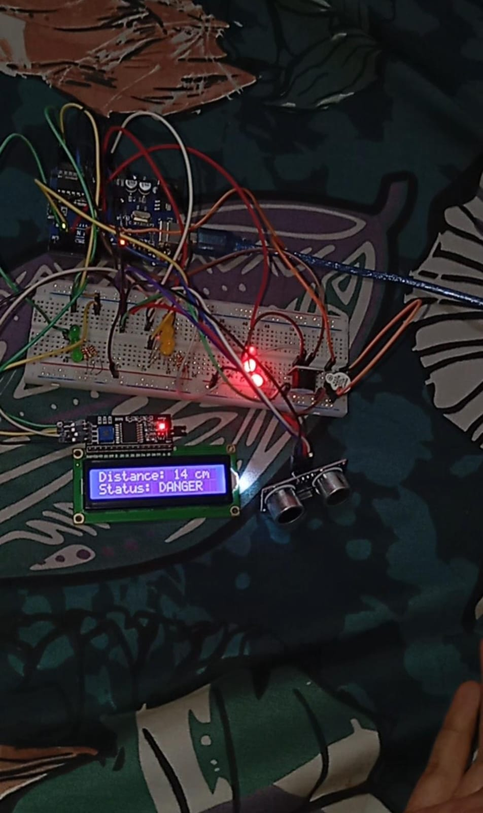

 

## 🎬 Demo

<!-- DRAG YOUR parking_sensor_demo.mp4 INTO THIS SPOT IN THE GITHUB README EDITOR -->
<!-- GitHub will auto-generate a video embed link here once uploaded -->

## ✨ Overview

A car park-assist style distance alarm — an HC-SR04 ultrasonic sensor measures distance to an object, an I2C LCD displays the live reading, three-color LED banks show range at a glance, and dual buzzers escalate their beeping as the object gets closer.

## 🚀 Features

| Feature | Description |
|---|---|
| 📏 **Live Distance Readout** | Real-time cm measurement on a 16x2 I2C LCD |
| 🟢🟡🔴 **3-Tier LED Indicator** | 9 LEDs (3 green / 3 yellow / 3 red) grouped by range |
| 🔊🔊 **Escalating Alarm** | Silent → single slow beep → dual fast alarm as distance shrinks |
| ⚙️ **Zero Extra Sensors** | Pure `pulseIn()` ultrasonic timing, no external distance libraries |

## 🧰 Hardware Used

| Component | Qty |
|---|:---:|
| Arduino Uno | 1 |
| HC-SR04 Ultrasonic Sensor | 1 |
| 16x2 I2C LCD | 1 |
| LEDs (Green/Yellow/Red) | 9 (3 each) |
| Resistors (per LED) | 9 |
| 3-pin active buzzers | 2 |
| Breadboard | 1 |
| Jumper wires | ~30 |

## 🔌 Wiring

Full pin-by-pin breakdown in [`docs/wiring_connections.md`](docs/wiring_connections.md).

<b>Quick reference (click to expand)</b>

 

| Sensor | Pin |
|---|:---:|
| TRIG | D9 |
| ECHO | D10 |

| LCD | Pin |
|---|:---:|
| SDA | A4 |
| SCL | A5 |

| LED Group | Pin |
|---|:---:|
| Green (x3) | D2 |
| Yellow (x3) | D3 |
| Red (x3) | D4 |

| Buzzer | Pin |
|---|:---:|
| Buzzer 1 (main) | D8 |
| Buzzer 2 (danger-only) | D7 |

⚠️ **Grounding note:** use all 3 of the Arduino's GND pins spread across the breadboard rail — a single GND pin isn't enough for this many components. See troubleshooting for why.

## ⚙️ How It Works

The HC-SR04 sends an ultrasonic pulse and measures how long it takes to bounce back, which the code converts into a distance in centimeters. Based on that distance, the system falls into one of three zones:

| Zone | Distance | LEDs | Buzzer Behavior |
|:---:|:---:|:---:|---|
| 🟢 **Safe** | > 30 cm | Green | Silent |
| 🟡 **Caution** | 15–30 cm | Yellow | Buzzer 1 beeps slowly |
| 🔴 **Danger** | < 15 cm | Red | Both buzzers beep rapidly together |

The LCD continuously shows the live distance on the top line and the current status (SAFE / CAUTION / DANGER) on the bottom line.

## 🛠️ Setup

| Step | Action |
|:---:|---|
| 1 | Wire the circuit per [`docs/wiring_connections.md`](docs/wiring_connections.md) |
| 2 | Open `code/parking_sensor.ino` in the Arduino IDE |
| 3 | Install the `LiquidCrystal_I2C` library (Library Manager → search "LiquidCrystal I2C") |
| 4 | Select **Arduino Uno** as the board and the correct COM port |
| 5 | Upload, open Serial Monitor at 9600 baud, and test by moving an object toward the sensor |

## 🐛 Troubleshooting

See [`docs/troubleshooting.md`](docs/troubleshooting.md) — includes the ground-pin fix for LEDs that wouldn't light up.

**Built with:** Arduino Uno · C++ · HC-SR04 · I2C LCD

*Know your distance before it's too late.* 🟢🟡🔴

